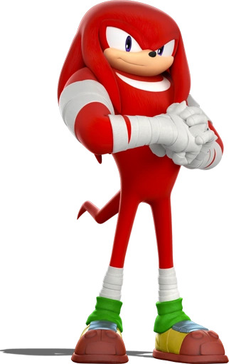

 

## Character Description

Knuckles the Echidna is the protector of the Master Emerald, and has been both a rival and a friend to the protagonist, [[Sonic The Hedgehog]]. Knuckles lives alone on Angel Island, and has devoted his entire life to protecting the Master Emerald from unsavory individuals. He is known for his unbelievable brawn, using his fists to smash through just about anything that gets in his way. At times he is portrayed as being able to use his strength to go toe to toe with even Sonic. He is the sole survivor of the Echidna race from the Knuckles Clan, living as a loner while remaining focused on his duty of protection. Knuckles was first introduced in 1994 in the game [[Sonic and Knuckles]], which introduced him as an adversary to [[Sonic The Hedgehog]] and [[Miles 'Tails' Prower]]. Since his introduction Knuckles has alternated between a sworn ally of Sonic and a fierce rival, but, like the other main cast, he has been integral to the story since his inception.

## Abilities

- Superhuman strength
- Gliding
- Climbing
- Swimming
- Hand-to-hand combat
- Empowered forms
