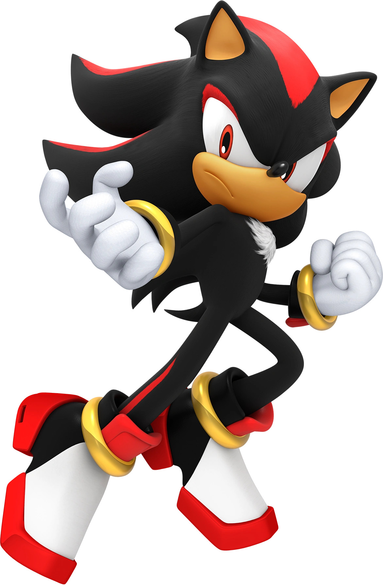

## Character Description

Shadow the Hedgehog is the main rival of [[Sonic The Hedgehog]]. Touting himself as the "Ultimate Life Form", Shadow has been offering as the mirror image to Sonic, other than Metal Sonic. Instead of running at super speed, Shadow uses his boots to glide along the ground in a skating fashion that allows him to move extremely quickly. Shadow is a creation of Ivo Robotnik's Grandfather, Dr. Gerald Robotnik. Shadow is often mistaken for Sonic throughout multiple different games and other stories within the franchise, playing into the "mirror" image that Shadow offers to Sonic. Shadow has a tragic past, haunted by the death of a close friend that he continues to grapple with throughout the entire series. Shadow was first introduced in Sonic Adventure 1, which was released in 2001. He boasts a plethora of different abilities, including a much more refined control over chaos energy, which allows him to tap into abilities that Sonic is not capable of using in his base form.

## Abilities

- Super speed
- Superhuman strength
- Chaos control
- Extreme durability
- Hand-to-hand combat
- Immortality
- Empowered forms
